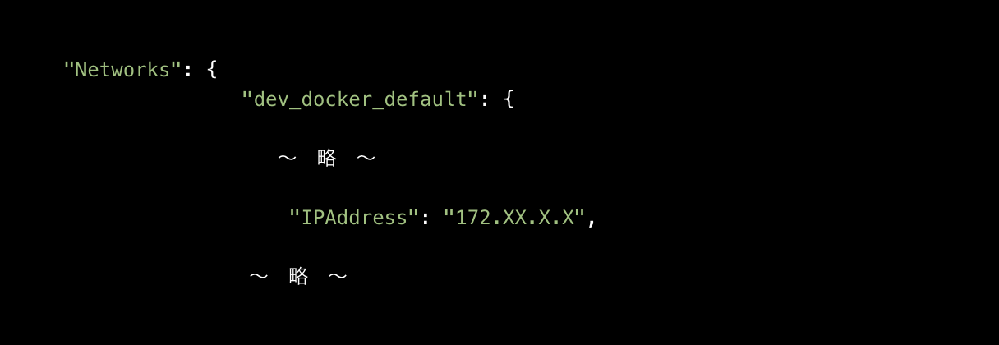

# step

dockerfileで呼び出している環境ファイルを作成
```terminal
touch .env.dev
```

コンテナを起動
```terminal
docker compose up -d
```

コンテナ名を確認
```terminal
docker container ls
```

```terminal
# EX). docker compose exec <CONTAINER_NAME> bash
docker compose exec python_app bash
```

```terminal
cd app
python sample.py 180

# >> 3.141592653589793
```

仮想環境の起動、activate
```terminal
python -m venv venv
source venv/bin/activate

<!-- 停止時 -->
deactivate
```

仮想環境内で、requirementsの設定ライブラリをインストール
```terminal
pip install -r requirements.txt
```

```terminal
cd app
django-admin startproject main
```

### コンテナのポートの設定
<https://note.com/ym202110/n/nbae068a98764>

コンテナのIDを調べる
```terminal
docker container ls
```

コンテナの詳細を調べて、使用しているネットワークを調べる

```terminal
docker inspect <CONTAINER_ID>
```



コンテナ内に入ってDjangoを実行する。その時にIPAdressと紐づけて実施すること

```terminal
python manage.py runserver <IPAdress>:8000
```
